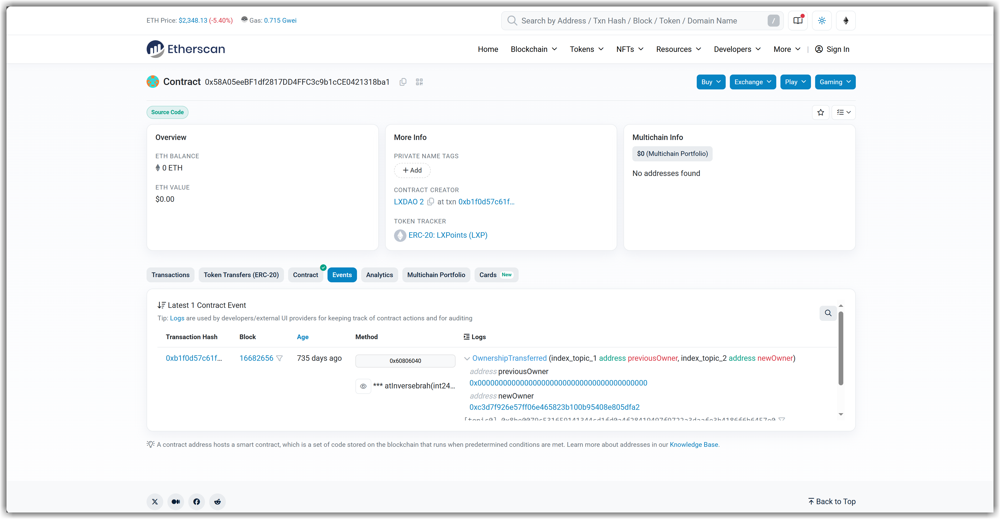

> 请在上边的 timezone 添加你的当地时区(UTC)，这会有助于你的打卡状态的自动化更新，如果没有添加，默认为北京时间 UTC+8 时区

# Kevin

1. 一个学生，一个编程小白
2. 有信心完成本次共学
3. https://t.me/ztm0929

## Notes

<!-- Content_START -->

### 2025.02.27

本次共学活动有一个 LXPU 激励，本小白完全不懂这是什么，我可以如何与它交互，也许可以趁着这次学习详细了解下。

根据[说明](https://lxdao.notion.site/LXDAO-Q-A-b77d0c920acc408caec0b26ea5c5efec)，LXPU 是 LXP + U ，1000 LXPU = 800 USD + 200 LXP

USD 好理解，就是美元。那么问题来了，LXP 如何获取呢？还是说 LXPU 获取的时候就包含了 USD 和 LXP ？

再根据另一份[文档说明](https://docs.lxdao.io/lxdao/jing-ji-mo-xing/gong-xian-zheng-ming-lxp)，LXP 部署在 Polygon 网络里，
因此我尝试使用 [Etherscan](https://etherscan.io/address/0x58A05eeBF1df2817DD4FFC3c9b1cCE0421318ba1) 和 [PolygonScan](https://polygonscan.com/address/0x58A05eeBF1df2817DD4FFC3c9b1cCE0421318ba1) 来搜索看看。

**我应该如何查看当前人们拥有的 LXP 数量呢？以及过往的转移记录呢？**

### 2025.02.28

- 一个 dApp 通常是多个智能合约的组合

- 我们需要从 Brand Based 的理念转为 Math Based。

### 2025.03.03

笔记内容

### 2025.03.04

<!-- Content_END -->
